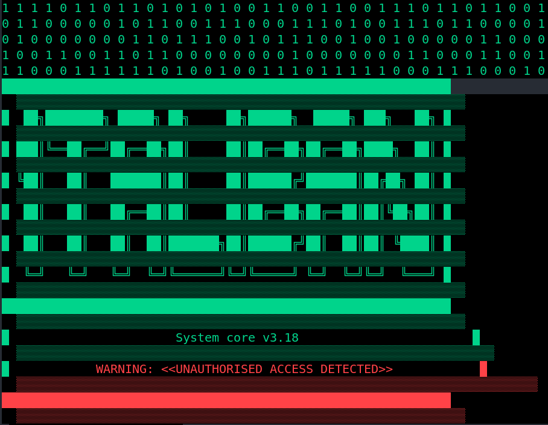
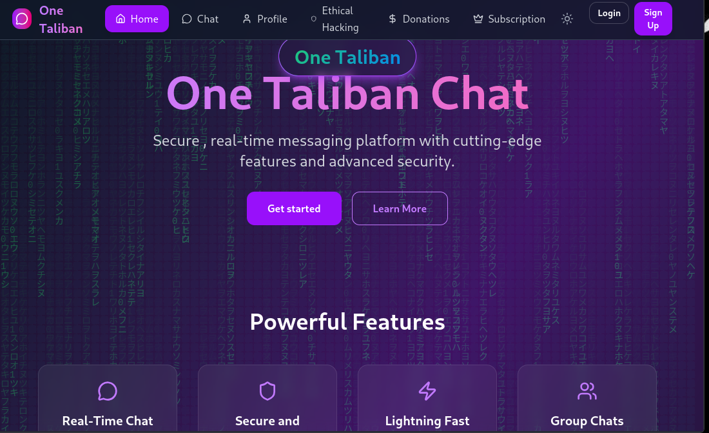
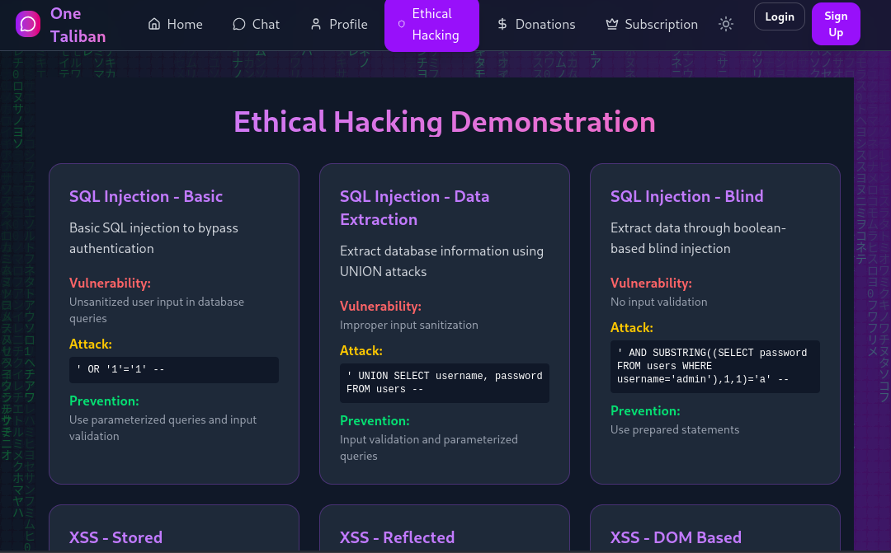
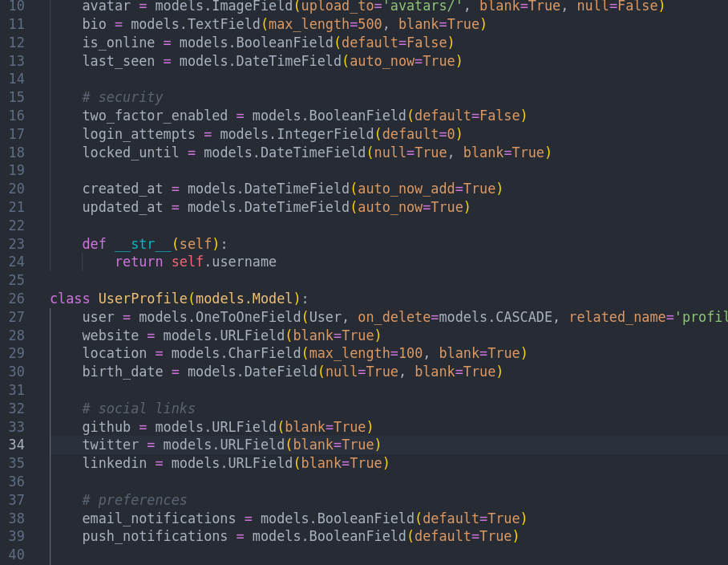
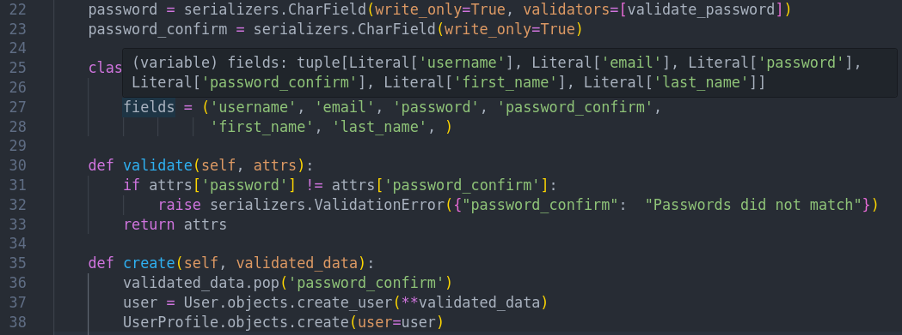
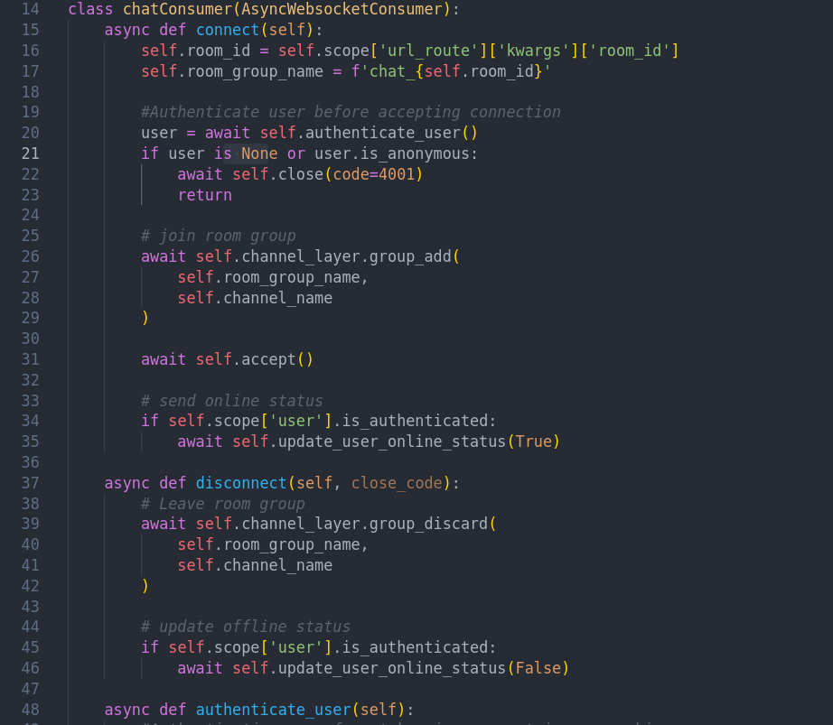
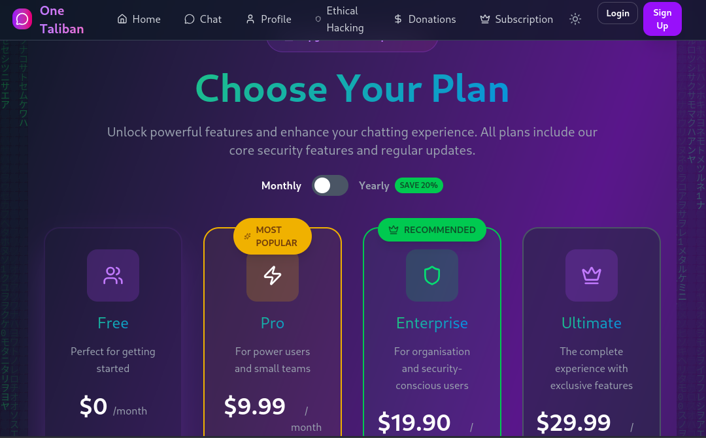

# ONE TALIBAN CHAT APP

## Technical Summary

**Practise beats mere knowledge; builds muscle memory**

**Real-time chat app using django-channels and react.js**

*This project is based on realtime message delivery using websocket technology which is guaranteed to have a connection at start and then follows seemless communication without the so called HTTP; which for every connection there must be handshake for server to receive the request. It not only contains the chat section but also very handy UI/UX with hacker like themes, glitches and background matrix, that makes me fell the app is very appreciating to me and hope you like the styling and themes included. I have dedicated a page to  highlight common payloads used in web penetration testing and security measures to consider.*

## Project UI/UX SnapShots

## Technical Stack
**Hereby follows the technologies, libraries ,frameworks and relevant neccessities I have used crafting and engineering this app from scratch:**

*Actually for my fullstack journey I felt choosing the latter as the best choice for me and the one currently at top*

- Python | Django | REST Framework 
- JavaScript | React | axios
- Tailwindcss | Framer motion | GSAP | Lucide react
- JWT Authentication | CORS
- PostgreSQL | SQLite

## Backend

*After a period of tire and hassle, I can comfortably engineer backend APIs, configure backend logic comfortably utilising Django and Django REST Framework. I find the framework quite supportive and with its large community, finding neccessary informations has not been a nightmare. Django well structured documentation has made the entire progress as a piece of cake. Thanks to Django developers, community at large*

**As a matter the backend requires a lot of logic and one needs to be carefull for all to work as expected. I hereby share the backend logic slightly for one to gain the notion of what is really happening:**

- For users registrations and logins , I do utilise JWT Authentication to for refresh and access tokens.
- As django models are very powerful for ORM, managing the defined class objects and executing *SQL* statements behind the hood, power my database structuring and organisation.
- REST Framework serializers come handy to manage *RESPONSES* ; serializing the data being sent and received from/to backend. Actually they do play a big role improving efficiency by reducing the time that could be used to structure responses to JSON required , commonly used for transfering data between networks.
- Built in REST Framework class based view also handy managing logics by just identifying variabales (eg. serializer_class).
- Configuring channels was actually the teasing part as I had not implemented a websocket by creating consumers relevant to the latter implementation. Have managed and currently working as desired.
- CORS aided dealing with the common cross-origin-request error commonly found.

### Backend SnapShots

**Models**

**Serializers**

**Consumers**

## Fronted

*The desire to satisfy user appealing and attractive UI/UX is an obviously hard task to acheive. I have utilised REACT.js to acheive this and common animation libraries tailored to integrate with react perfectly. Using TAILWINDCSS  is undebatable as per the current trends due to its high customization and JIT compiler. Framer motion is also tremendous due to ease of adding motions to the html nodes in the jsx. GSAP is another handy tool to craft you own animations to your html nodes appropriately*

**Key good design implemented**

- Reusable modals
- Context creation to avoid errors on prop drilling
- Implementation of utility classes
- Better components structure

### Frontend SnapShots

